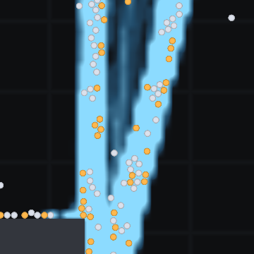
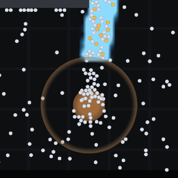
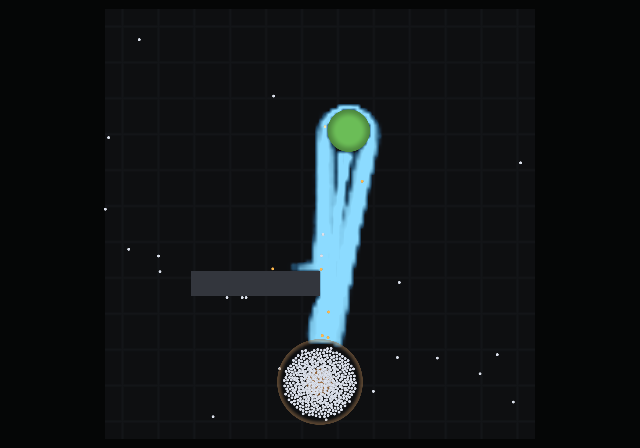

# antsim

A 2D ant colony simulation built on real behavioural science, in Common Lisp,
rendered with OpenGL.

Ants leave the nest, walk a correlated random walk, find food, fill their crop,
navigate home by path integration, and lay pheromone on the return trip in
proportion to the quality of what they are carrying. Other ants read that
pheromone through a nonlinear choice function, which amplifies a chance
difference into a committed trail. Food depletes, trails evaporate, the colony
converts food into workers, and a colony that cannot reach food starves.

None of that is scripted. **There is no way to author a trail** — the scenario
format cannot express one, and no function exists to paint one. Every trail in
every picture below was deposited by an ant that walked there.


*Twenty simulated minutes. The nest is the brown disc at the bottom, the food
source the green disc at the top, and the blue field is pheromone the ants laid
themselves. The colour turns where the concentration crosses `k`, the point at
which ants stop exploring and start committing — so the bright core is the part
they are actually reading as a road.*

## What emerges

The trail runs in **two lanes**. Nobody wrote that; it falls out of outbound and
returning ants biasing to opposite sides of a shared route.



*Outbound ants are pale, laden returners warm orange. Zoomed to 18 cm.*

Crowding at the nest is not modelled either — it is the same non-overlap rule
that stops ants walking through walls, applied to a hundred ants arriving at one
entrance.



*The nest disc, its arrival radius as a faint ring, and the resting cluster the
collision rule packs around the entrance.*

Early on, before any trail exists, the colony looks completely different — every
ant searching, the choice function degenerating exactly into a random walk
because there is no pheromone for it to read:


And an hour in, the colony has grown into the trail it built — more ants because
the trail works, a thicker trail because there are more ants:



Every image above is generated by `make gallery` from a fixed seed, so the
documentation cannot drift away from what the simulation does.

## Running it

Needs SBCL and Quicklisp. The Makefile points `CL_SOURCE_REGISTRY` at the
checkout, so a clone builds where it stands with no setup.

```sh
make test              # core suite: RNG, pool, geometry, fields, ants
make live              # the interactive window
make gallery           # regenerate the images above
make test-render       # renderer suite, on the GPU
make test-render-mesa  # the same suite in software — no GPU needed
```

GPU targets wrap the command in a `guix shell`; see [the design
document](docs/concept.md#46-building-and-running) for why, and for what to do
when a render comes back black.

### The window

| input | action |
|---|---|
| mouse wheel | zoom, anchored at the cursor |
| right-drag | pan |
| left-click | inspect an ant — state, energy, crop, age, distance home |
| `space` | pause |
| `+` / `-` | time compression, halving and doubling |
| `home` | frame the whole world |
| `q` / `escape` | quit |

## The design document

**[docs/concept.md](docs/concept.md) is the design document**, and it is the
place to start for anything beyond running the thing. It covers the science the
model is built on and, more importantly, what was deliberately left out of the
first version and why. There is an illustrated version of the same material at
[docs/concept.html](docs/concept.html), published at
[bonkzwonil.github.io/antsim](https://bonkzwonil.github.io/antsim/).

A few entry points:

- [§3.3 Pheromones and the nonlinearity that matters](docs/concept.md#33-pheromones--the-field-and-the-nonlinearity-that-matters) — the Deneubourg choice function, which is the whole model
- [§3.8 What must emerge](docs/concept.md#38-what-must-emerge--the-acceptance-list) — the acceptance list, which is the project's definition of "working"
- [§3.9 The M1 cut](docs/concept.md#39-the-m1-cut--what-actually-gets-built-first) — what was left out, and why none of it is load-bearing
- [§7 Milestones](docs/concept.md#7-milestones) — where the project is

## Where it is

M0 (toolchain) and the bulk of M1 (the simulation) and M2 (the renderer and
window) are done. Four of §3.8's acceptance rows pass — homing without a trail,
colony extinction, and both halves of the nonlinearity control. The rows that
need bridge scenarios — symmetry breaking, shortest-path selection,
quality-driven selection, trail death — are the next work, together with the
calibration pass they imply.

The colony in the pictures grows to a **carrying capacity** rather than
increasing without bound: workers burn energy to live, the colony's stock is the
difference between what foragers bring in and what the nest consumes, and when
that reaches zero the birth rate does too. How many ants a colony can support is
therefore a result of how far the food is and how good the trail to it is, which
is the coupling §3.10 is about.

## Licence

MIT.
