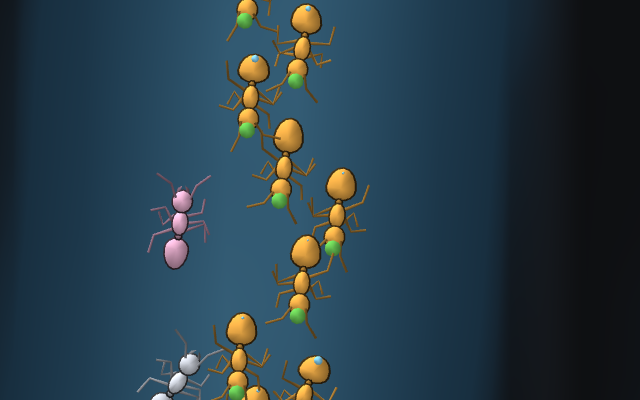
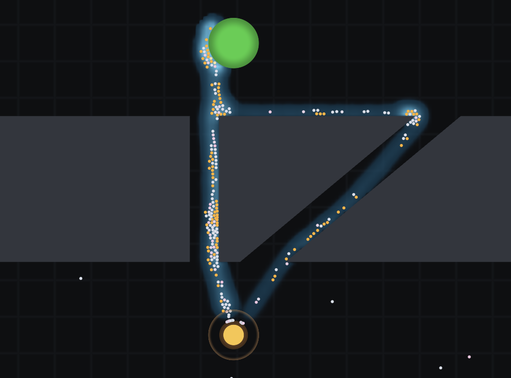
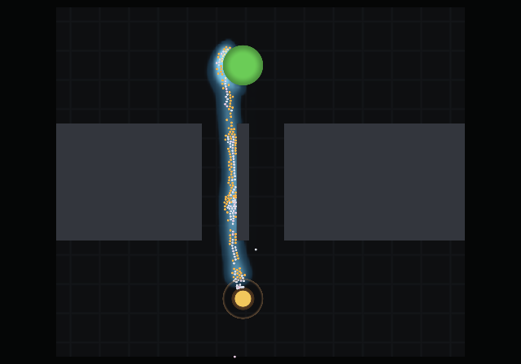

# antsim

**A 2D ant colony simulation built on real behavioural science, in Common Lisp,
rendered with OpenGL.**


<sub>*The project's own name, spelled in obstacles, run as a scenario. The nest
is below the word and two food sources sit above it, so every trail has to find
its way through the lettering. Nothing in the simulation can see the word, plan a
route, or measure a distance — those two roads are a few thousand pheromone
packets, each one deposited by an ant that walked there.*</sub>

Ants leave the nest, walk a correlated random walk, find food, fill their crop,
navigate home by path integration, and lay pheromone on the return trip in
proportion to the quality of what they are carrying. Other ants read that
pheromone through a nonlinear choice function, which amplifies a chance
difference into a committed trail. Food depletes, trails evaporate, the colony
converts food into workers, and a colony that cannot reach food starves.

None of that is scripted. **There is no way to author a trail** — the scenario
format cannot express one, and no function exists to paint one.

And close enough, an ant is an ant.



<sub>*A trail at 4.5 cm. Six legs on an alternating tripod, sweeping antennae,
mandibles, a swollen gaster on the ants carrying a load — one mesh of ninety-odd
triangles, articulated in the vertex shader from eight floats per ant. The legs
do not slide, because the stride is driven by distance walked rather than by the
clock. [More in the diary](docs/DIARY.md#traffic--and-an-ant-close-enough).*</sub>

## Why Common Lisp

Because a simulation is an experiment, and an experiment needs an off switch.
All 65 parameters of this model are special variables, so an A/B is a `let`
around the run rather than a configuration mechanism — and when the binding
ends, so does the change. Everything else is lexically scoped, and the language
tells the two apart at a glance.

SBCL then compiles straight to machine code — no VM, no JIT warm-up — and with
types declared the numeric core runs level with C and occasionally past it. So
the exploratory half and the tight loop are the same language in the same file,
and over SLIME you can recompile one function into a colony that is already
running instead of starting the twenty simulated minutes again.

**[The full argument, with the code it rests on →](docs/WHYLISP.md)**

## It reproduces the published experiments

The point of building on real behavioural science is that the results are
*checkable*. Two of the founding experiments in the field are laboratory
apparatus with published outcomes, and both are in the test suite, with the
papers' own criteria. `make acceptance` runs them.



<sub>*Goss's double bridge. Two corridors lead from the nest to the food and one
is longer. Nothing in the model can measure a distance, compare two routes, or
tell that an alternative exists — yet the traffic collapses onto the short one,
because ants that take it get home sooner and lay pheromone sooner.*</sub>

Sixteen seeds each, the acceptance protocol — fixed colony, six minutes to
commit, six minutes measured:

| experiment | what it asks | mean busiest arm | result over 16 seeds |
|---|---|---|---|
| **Deneubourg's binary bridge** (1990) | two *equal* arms — does the colony break the symmetry? | 0.944 | commits every time, **9 / 7** between the arms |
| **Goss's double bridge** (1989) | one arm 1.73× longer — does it find the short one? | 0.814 | short arm wins **16 / 16** |



<sub>*Deneubourg's binary bridge. The two corridors are identical and one of them
is carrying all the traffic — that asymmetry is the entire result, and which side
it lands on changes with the seed.*</sub>

The binary bridge's second half is the harder one: a model that always picked
arm A would pass the first and be broken. The result is that the colony **makes
a choice**, not that it has a preference. The double bridge is the opposite — it
*should* look the same every run, so watching it pick the short arm over and
over is the result rather than a stuck seed.

In detail: [the sixteen-seed protocol and the table above](docs/experiments.md#individual-walking-speed-31--shipped)
· [symmetry breaking, off its own test rig](docs/experiments.md#symmetry-breaking-off-its-own-test-rig)
· [the density window](docs/experiments.md#the-double-bridge-has-a-working-density-window),
which is the one caveat to read before quoting either number — past about 900
ants congestion decides the route and the long arm wins outright, so a bridge
result quoted without its colony size is under-specified.

Both ship as scenarios too, so you can watch one instead of reading a number:

```sh
SCENARIO=scenarios/deneubourg-binary-bridge.json make live   # winner changes per run
SCENARIO=scenarios/goss-double-bridge.json make live         # short arm, every time
```

The apparatus is [`src/world/bridge.lisp`](src/world/bridge.lisp); the criteria
are recorded in
[§3.8](docs/concept.md#38-what-must-emerge--the-acceptance-list). Tests assert
that those scenario files and the Lisp constructors build the same apparatus
vertex for vertex, and that the binary bridge's arms are equal to the last
float — otherwise the published result and the thing you can look at would be
two different experiments with the same name.

## Running it

Needs SBCL and Quicklisp. The Makefile points `CL_SOURCE_REGISTRY` at the
checkout, so a clone builds where it stands with no setup. GPU targets wrap the
command in a `guix shell`; see
[§4.6](docs/concept.md#46-building-and-running) for why, and for what to do when
a render comes back black.

```sh
make test              # core suite: RNG, pool, geometry, fields, ants
make acceptance        # the §3.8 experiments: both bridges, sixteen seeds
make live              # the interactive window
make gallery           # regenerate the documentation's images
make test-render       # renderer suite, on the GPU
make test-render-mesa  # the same suite in software — no GPU needed

SCENARIO=scenarios/foraging.json make live
SEED=12345 make live   # repeat an exact run
```

Six scenarios ship:

| scenario | what it is for |
|---|---|
| `foraging` | a source that visibly empties, and a colony that starves when it does |
| `deneubourg-binary-bridge` | equal arms — the winner changes between runs |
| `goss-double-bridge` | unequal arms — the short one wins every time |
| `antsim` | the name in obstacles, on a desk-sized 1.00 × 0.72 m arena |
| `antsim-large` | the same word five times over, at 5.00 × 3.60 m |
| `antsim-overload` | the small arena with 1400 ants on 40 units of stock |

Scenarios are JSON ([§6](docs/concept.md#6-the-scenario-file)) and validation is
strict: an unknown key is an error and the message names the path, because a
silently-defaulted typo produces a run that looks plausible and answers a
different question than the one you asked.

### The window

The window lists its own keys in the bottom-right corner, and opens at **4×**
rather than real time — the things worth watching take minutes to an hour.

| input | action |
|---|---|
| mouse wheel | zoom, anchored at the cursor |
| right-drag | pan |
| left-click | inspect an ant — state, energy, crop, age, distance home, and whether it has the reserve to set out |
| `a` | drop a food source at the cursor |
| `n` | resting ants: collide with each other, or pass through |
| `space` | pause |
| `+` / `-` | time compression, halving and doubling |
| `home` | frame the whole world |
| `h` / `?` | hide or show the key legend |
| `q` / `escape` | quit |

Ants are coloured by what they are doing: pale outbound, warm orange carrying a
full crop, **red when they no longer have the energy to leave the nest**, grey
once dead.

The window draws a **fresh seed each session** and prints it, so no two runs are
alike and any worth keeping can be replayed with `SEED=`. That matters most on
the binary bridge, where the result is that the winning arm *varies*. The
headless paths — tests, acceptance, gallery — stay deterministic. A playground
and a result are different things.

## The documentation

- **[docs/concept.md](docs/concept.md) is the design document**, and the place
  to start for anything beyond running it: the science the model is built on
  and, more importantly, what was deliberately left out and why. There is an
  illustrated version at [docs/concept.html](docs/concept.html), published at
  [bonkzwonil.github.io/antsim](https://bonkzwonil.github.io/antsim/).
- **[docs/experiments.md](docs/experiments.md)** — the measurement log. What was
  changed, what it was measured against, and which of those measurements have
  since expired. A negative result has a shelf life.
- **[docs/DIARY.md](docs/DIARY.md)** — what a run actually looks like, frame by
  frame, and the eight failures that were caught by watching rather than by
  counting.
- **[docs/WHYLISP.md](docs/WHYLISP.md)** — why Common Lisp and SBCL are the
  right tools for this, argued against the code rather than in the abstract.
- **[docs/config.md](docs/config.md)** — every switch, its default, and where to
  set it.

Three entry points into it:
[§3.3 the choice function](docs/concept.md#33-pheromones--the-field-and-the-nonlinearity-that-matters), which is the whole model
· [§3.8 the acceptance list](docs/concept.md#38-what-must-emerge--the-acceptance-list), which is the definition of "working"
· [§7 milestones](docs/concept.md#7-milestones).

## Where it is

**Version M3 · 2026-08-16.** M0 and M2 are signed off, M2.1 and M2.2 landed
their corrections, and **M1's two defining rows pass** — symmetry breaking and
shortest-path selection, on the apparatus above. Seven of §3.8's ten in-scope
rows pass; the three that remain — quality-driven selection, no trail below the
quality threshold, and task reallocation — need a two-source apparatus.

**M3 is half done, and the missing half is the interesting one.** The ant is an
ant now: an articulated vector body on an alternating tripod gait, with antennae
that sweep the pheromone field they are standing on, at eight floats per ant per
frame. What is *not* built is the **encounter event** — today the broad phase
reports overlaps to be resolved and nothing else, so two ants meeting head-on
push each other apart and neither prefers a side. Turning that into *this ant
met that ant, at this bearing* is what lane formation and the
social-information channel of §3.4 both need, and it is next.

The full record, including what shipped switched **off** and why, is
[§7](docs/concept.md#7-milestones).

## Copyright and licence

Copyright © 2026 Mathias Menzel-Nielsen. All rights reserved.
