# antsim


*Goss's double bridge, run on this model. Two corridors lead from the nest to
the food and one is longer. Nothing in the simulation can measure a distance,
compare two routes, or tell that an alternative exists — yet the traffic
collapses onto the short one, because ants that take it get home sooner and lay
pheromone sooner. Every mark in that picture was deposited by an ant that
walked there.*

**Version M3 · 2026-08-16** — the ant is an ant now: a real articulated vector
body on an alternating tripod gait, with antennae that sweep the pheromone field
they are standing on. That is the first half of M3; the second half, what
happens when two ants meet, is not built. See [where it is](#where-it-is) for
what that covers and what is next.

A 2D ant colony simulation built on real behavioural science, in Common Lisp,
rendered with OpenGL.

Ants leave the nest, walk a correlated random walk, find food, fill their crop,
navigate home by path integration, and lay pheromone on the return trip in
proportion to the quality of what they are carrying. Other ants read that
pheromone through a nonlinear choice function, which amplifies a chance
difference into a committed trail. Food depletes, trails evaporate, the colony
converts food into workers, and a colony that cannot reach food starves.

None of that is scripted. **There is no way to author a trail** — the scenario
format cannot express one, and no function exists to paint one. Every trail in
every picture below was deposited by an ant that walked there.

## It reproduces the published experiments

The point of building on real behavioural science is that the results are
*checkable*. Two of the founding experiments in the field are laboratory
apparatus with published outcomes, and both are in the test suite — as
experiments, run on the model, with the papers' own criteria.

### Deneubourg's binary bridge (1990) — symmetry breaking


Two arms of **equal** length between nest and food. There is no better route,
so any departure from an even split has to be the colony's own doing. In the
picture the two corridors are identical and one of them is carrying almost all
the traffic — that asymmetry is the entire result, and it was produced by the
run rather than drawn.

| seed | arm A | arm B | committed to |
|---|---|---|---|
| 1 | 6.1% | **93.9%** | B |
| 2 | 5.2% | **94.8%** | B |
| 3 | **93.1%** | 6.9% | **A** |
| 4 | 4.2% | **95.8%** | B |
| 5 | 4.9% | **95.1%** | B |
| 6 | 3.7% | **96.3%** | B |
| 7 | 6.7% | **93.3%** | B |
| 8 | **95.2%** | 4.8% | **A** |

Every replicate commits — never below **93%** — and *which* arm it commits to
changes with the seed. Both halves matter, and the second is the harder one: a
model that always picked arm A would pass the first and be broken. The result is
that the colony **makes a choice**, not that it has a preference.

Over a wider sweep of 16 seeds the split is **7 / 9** — no side is favoured, and
re-centring the arena about the bridge (it is very slightly off-centre) changes
nothing, which was worth checking rather than assuming.

**This is the one to watch run.** `make live` draws a fresh seed each session,
so successive runs land on different arms:

```sh
SCENARIO=scenarios/deneubourg-binary-bridge.json make live
```

And the commitment is **metastable, not permanent** — watch long enough and a
run can swap arms and swap back. That is not the seed slipping. Evaporation
never stops, so a committed trail is only held up by traffic renewing it, and a
jam at one corridor is enough to break it: a congested arm takes *longer to get
round*, which is precisely what makes the long arm lose on the double bridge
below. Nothing measures distance; what matters is how fast the loop closes, and
congestion lengthens it just as geometry does. The same rule, running backwards.

Two honest caveats. Our τ is compressed 30× so evaporation is watchable, which
makes the field forget faster than in the real dishes and switching
correspondingly more likely. And the acceptance test measures the *initial*
commitment (a window at 6–12 minutes), so it says nothing about long-run
stability either way.

The arms are equal to the last float, which the test asserts rather than
assumes. An asymmetric bridge would produce a lopsided split that looks exactly
like success.

### Goss's double bridge (1989) — shortest path

Now one arm is longer: 0.415 m against 0.717 m, a ratio of **1.73**. Same fork,
and the corridors are the same width *perpendicular to their own centre lines*,
so the arms differ in length and in nothing else.

| seed | short arm | long arm | | seed | short arm | long arm |
|---|---|---|---|---|---|---|
| 1 | **70.1%** | 29.9% | | 5 | **71.4%** | 28.6% |
| 2 | **78.9%** | 21.1% | | 6 | **69.4%** | 30.6% |
| 3 | **75.7%** | 24.3% | | 7 | **75.8%** | 24.2% |
| 4 | **72.3%** | 27.7% | | 8 | **83.3%** | 16.7% |

**The short arm wins eight times out of eight** — so unlike the binary bridge,
this one *should* look the same every time you run it. Watching it pick the same
arm over and over is the result, not a stuck seed.

Here is why that is worth the trouble: *nothing in the model measures a
distance.* No ant compares two routes, no code knows an arm exists, and the word
"shortest" appears nowhere in the simulation. Ants on the short arm simply
complete the round trip sooner, so they lay pheromone on it sooner and more
often per unit time — and the nonlinear choice function amplifies that head
start into a commitment. The geometry does the optimisation.

Run them yourself with `make acceptance`. The apparatus is
[`src/world/bridge.lisp`](src/world/bridge.lisp); the criteria are the papers',
recorded in [§3.8](docs/concept.md#38-what-must-emerge--the-acceptance-list).

Both also ship as scenario files, so you can watch one instead of reading a
number:

```sh
SCENARIO=scenarios/goss-double-bridge.json make live
```

A test asserts that the files and the Lisp constructors build the same
apparatus vertex for vertex — otherwise the published result and the thing you
can look at would be two different experiments with the same name.

### The experiment has a working density window

Both bridges are run with a **fixed** colony, because that is how they were run
in the laboratory: the question is whether trail-laying *alone* selects an arm,
so anything else that could do the selecting has to be held still. A colony
that breeds during the run is exactly such a thing.

How many ants turns out to matter more than that, and it is the sort of result
this project exists to find. Over ten seeds, with the population held fixed:

| ants | worst replicate | mean share |
|---|---|---|
| 150 | 0.544 | 0.805 |
| **250** | **0.671** | 0.788 |
| 400 | 0.552 | 0.723 |
| 900 | *long arm wins* | 0.690 |
| 1200 | *long arm wins* | 0.668 |

**Past about 900 ants the long arm wins.** Crowding does not merely weaken the
shortest-path result — it *inverts* it, because congestion in the corridors
starts deciding the route instead of pheromone. Below about 250 the opposite
failure: too little traffic for the nonlinearity to latch onto, so individual
runs wander.

So a bridge result quoted without its colony size is under-specified, and this
model will tell you a different thing about ants depending on how many of them
you put in the room. That is not a defect to be tuned away; it is the same
congestion effect visible everywhere else in these pictures, arriving where it
can be measured. The full record is in
[docs/experiments.md](docs/experiments.md), including three explanations that
were wrong before this one.

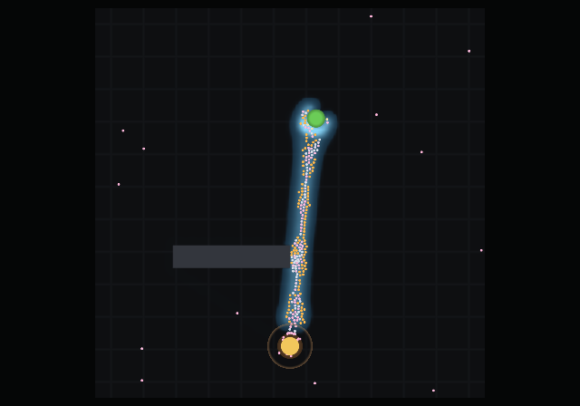

*Twenty simulated minutes. The nest is the disc at the bottom, the food source
the green disc at the top, and the blue field is pheromone the ants laid
themselves. The colour turns where the concentration crosses `k`, the point at
which ants stop exploring and start committing — so the bright core is the part
they are actually reading as a road, and the halo around it is the same
deposits fading off by radius.*

Ants do not paint a stripe. A laden ant puts its gaster down every couple of
centimetres, and each touch is a **packet** — a point whose intensity falls
away exponentially with radius. The road in the picture is a few thousand of
those overlapping, which is why it has a soft edge instead of a hard one.

## What emerges

At **5 minutes** the colony is running **two routes** to the same food, and by
**20 minutes** it is running one. Nothing chose between them. The choice
function is nonlinear — `P(i) ∝ (k + C_i)ⁿ` with `n = 2` — so whichever route
happens to be marginally better used gets marginally more traffic, which makes
it marginally stronger, and the difference runs away with itself. That
amplification is the entire model, and here it is doing its job in the gap
between two pictures.

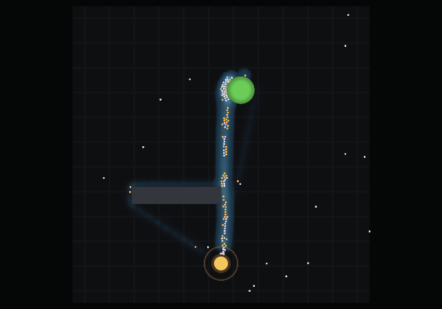

*Two roads from the nest to the source, of nearly equal strength.*

Compare the twenty-minute frame at the top: one road, and no trace of the other.
Set `n = 1` and this never happens — the colony splits evenly between routes
forever, which is a control the test suite keeps.

On the surviving road, traffic runs both ways at once.

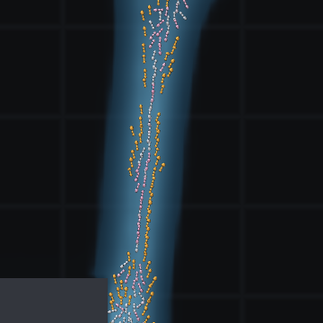

*Outbound ants are pale, laden returners warm orange, and the few red ones no
longer have the energy to leave the nest. Zoomed to 18 cm.*

And close enough, an ant is an ant.


*The same stretch of trail at 4.5 cm. Six legs on an alternating tripod, two
antennae, mandibles, a swollen crop on the ants carrying one, and the pale blue
dot at a gaster tip is the exact moment a pheromone packet went into the ground.
Nothing here is a sprite: it is one mesh of ninety-odd triangles, articulated in
the vertex shader from eight floats per ant.*

The thing worth watching is the **legs**, and specifically that they do not
slide. The stride phase advances with the **distance an ant has walked**, not
with the clock, so over the half-cycle a leg spends on the ground its foot slides
backward through the body exactly as fast as the body slides forward — which
means the foot is standing still in the world, which is what a foot does. Drive
the same animation from a timer and every ant moonwalks. It is one divisor, and
it is the whole difference between an ant that walks and an ant that is dragged.

The rest of what is drawn is mechanism rather than decoration:

- **Antennae sweep, and lean toward what they smell.** Each one samples the
  pheromone field either side of its own tip and bends toward the stronger, by
  the same comparison the ant's own choice function makes (§3.4). You can watch
  an antenna find a trail several ticks before the body turns onto it.
- **The gaster tips down** at the instant a packet is deposited — a visible event
  marking an otherwise invisible mechanism — and the mark it leaves is drawn in
  the trail's own colour.
- **A full crop is a fat gaster**, because *Lasius* carries liquid and the crop is
  internal. The bead at the mandibles is the conventional cue; the swelling is
  the honest one.
- **Dead ants curl their legs under** and stay where they fell (§3.11), so the
  approaches to a starving nest fill up with recognisable corpses rather than
  with grey dots.

Zoom out and it all goes away. At about four pixels an ant loses its legs, and
below that it is the plain disc it always was — the pheromone shader
antialiases a circle better than ninety triangles ever will, and at three pixels
the legs are noise. Every whole-arena picture on this page, including the one at
the top, is drawn by exactly the shader that drew it before the ant had legs.

### A traffic jam that feeds itself

This is the best thing in the simulation, and nothing in the model is aware of
any part of it.

The route has to squeeze past the end of the obstacle. Ants collide there,
because ants are discs that cannot overlap — the same rule that stops them
walking through walls. So a **bulb** of jammed ants forms at the corner.

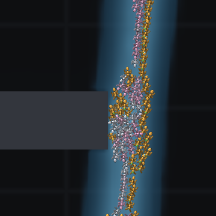

*The obstacle's right-hand end. Note the ants pressed flat along its top edge:
they hit the wall and slide. Zoomed to 13 cm.*

Now the part that makes it interesting. Pheromone is laid **per distance
walked**, and the distance counted is the step the ant *attempts* — an ant
shoving against a crowd is still walking, gaster still touching down, even
though the collision pass pushes it back. So the ants stuck in that queue go on
marking while barely advancing.

The jam therefore lays itself down more heavily than open trail. That stronger
mark recruits more ants to precisely the spot they are already stuck at, which
makes the queue longer, which lays more pheromone.

Congestion and recruitment are two separate rules that were never written to
know about each other, and here the geometry of a rectangle closes a feedback
loop between them. Nobody scripted a bottleneck. There is no bottleneck in the
model; there is a rectangle and a rule about discs not overlapping.

(Path integration makes the opposite choice — it uses the ant's *actual* net
displacement, because that one is about where the ant really is. Both are
right, for different reasons.)

The same collision rule produces the scrum at the source, where arriving ants
compete for an edge that gets **shorter as the pile goes down** — a depleting
source physically supports fewer feeding ants at once.

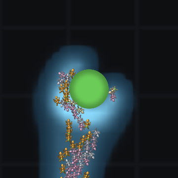

*Ants packed around the green source, laden ones already turning for home
against the incoming stream. Zoomed to 13 cm.*

Crowding at the nest is the same rule again, applied to a few hundred ants
arriving at one entrance.

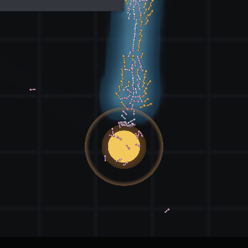

*The nest disc, its arrival radius as the faint ring, and the resting cluster
the collision rule packs around the entrance. The gold disc inside is the food
stored in the nest, drawn so its **area** is the quantity — it visibly empties
rather than staying full until the instant it is gone. Food sources do the same
thing, except that theirs is the real collision circle: a pile half eaten is
half the area, offers a shorter edge, and so feeds fewer ants at once.*

## How it starts

The same colony and the same seed, seconds in.

At **5 seconds** the pheromone total is *exactly* zero. No ant has reached the
food, so nothing has been laid, and the choice function is running with nothing
to read — which makes it, exactly, the correlated random walk. There is no
trail-following mode to switch on: following and exploring are the same rule in
two different environments.

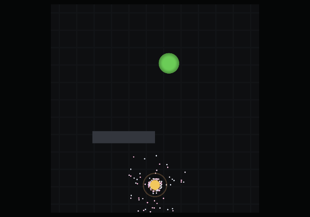

At **40 seconds** the total is 969 and one faint line runs from the food to the
nest. That is the first ants home, laying the first pheromone.

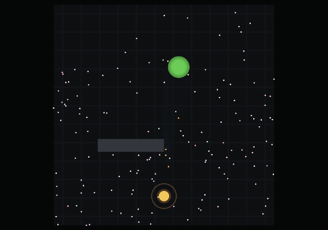

By **5 minutes** that thread has become a road — in fact two of them, which is
the frame [above](#what-emerges). The total is 56 208, and the population is still exactly the 150 it started
with: the colony is feeding itself but has not yet banked enough surplus for
the queen to lay against, and the brood she does lay takes time to emerge
(§3.10). Growth comes later, and lags the food that pays for it.

Everything in the pictures above grew from those first ants, by the ants' own
rules. The colour scale is identical across every image, so a trail that looks
stronger is stronger.

## How it ends

The source in this scenario is finite, and it runs out after **28 minutes**.
What happens over the next six is the part worth watching.

### The road outlives the source

At the moment the source empties, the trail is at full strength — 71 004 units
— and the colony is still pouring ants onto it.

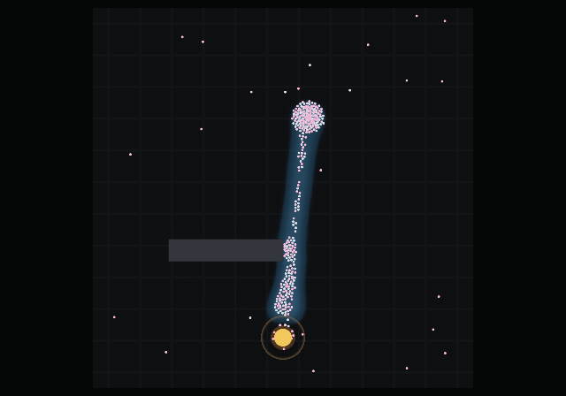

Following a trail and depositing on one are **separate rules**. An ant follows
whatever pheromone is in front of it; an ant deposits only when it is carrying
food. So the traffic continues and the renewal stops, and evaporation starts
taking the road out from under the ants still walking it.

**Two minutes later** the trail is down to 9 621 — 86% gone — and the ants are
still packed along the line where it was, including a knot where the food used
to be. Not one of them is orange, because there is nothing left to carry.

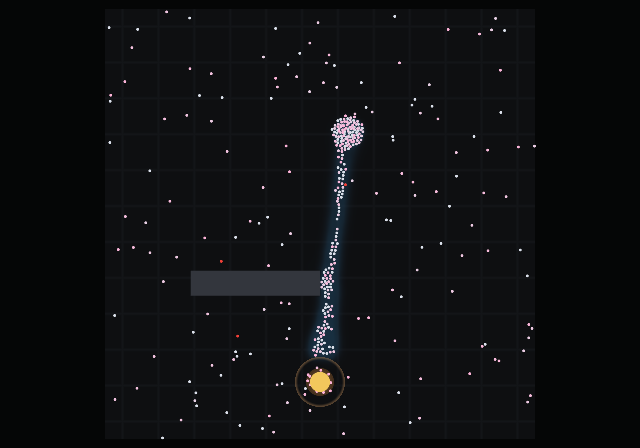

**Six minutes** and it is 176, from 71 004. The structure is simply gone, and
with it every trace of where the food had been. The colony disperses back into
the random walk it started with — and the red ants are the ones that no longer
have the reserve to try again.

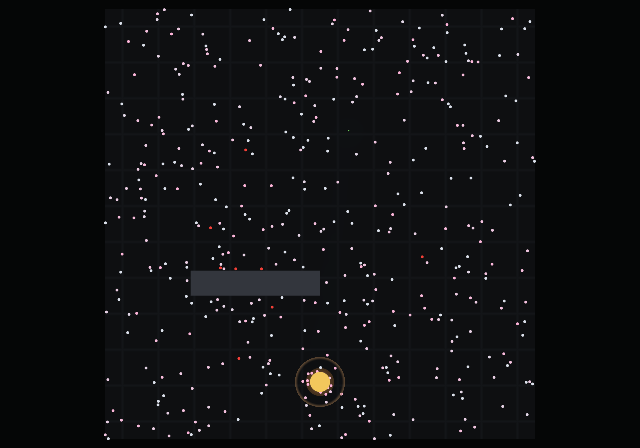

The population is *rising* through all three frames — 390, 414, 462 — because
the colony is still converting its stored food into workers while its road
dissolves. It is at its largest a few minutes after it has already lost.

That is evaporation doing the job it exists for. It is the only mechanism by
which a colony can forget, and without it these ants would walk to an empty
patch of ground for ever.

### And then the colony

As the larder runs down, the
ants' **urge to forage rises**: departures get more frequent and foragers push
deeper into their own reserve before turning back. The nest empties itself out
of doors — at one point **589 of 667 ants are outside at once** — they search,
they find nothing, and they come home spent. By 60 minutes the population is **0**,
the trail has evaporated to **nothing at all**, and there is no pheromone left
anywhere to say a road was ever there.

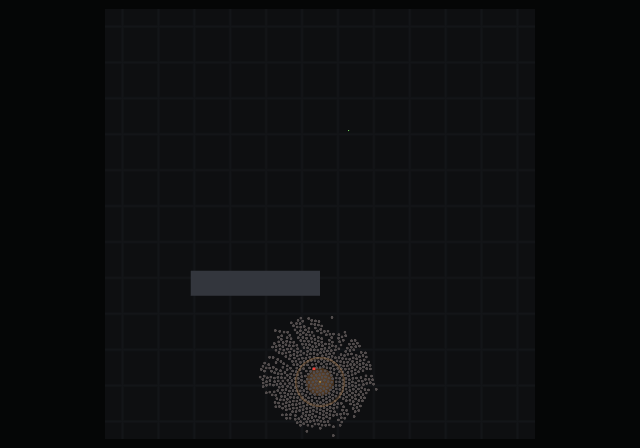

*The corpses are the pale discs, packed into a rosette around the nest entrance
— they came home to die. Nothing removes them, because nothing in the colony
knows how yet: necrophoresis is a later milestone, and until it exists the dead
stay where they fell.*

Every image here is generated by `make gallery` from a fixed seed, so the
documentation cannot drift away from what the simulation does.

## What watching it found

The renderer was built early on the argument that **the model's failures are
shaped like pictures** — that some of them would be obvious on screen and
invisible in any statistic worth printing. That has now happened seven times.
Ants pinned along all four arena walls. Ants stranded with a full crop and a
home vector reading zero. A shell of resting ants at a radius nothing explained.
Newborns filing out to the left in a line. A food source that stayed fat and
green while the colony starved next to it.

The two below are the best of them, and neither left a mark on any number the
program was printing at the time.

The best of them is this one. **The colony could starve with the door shut.**

Setting out required energy. Energy came from the nest's stock. The stock came
from ants setting out. When a source ran dry, those three closed into a ring:
every forager came home, dropped below the departure threshold, could not be
fed, and lay in the nest until it died of old age — without one of them ever
going out to look. Measured at the time: **499 ants in the nest, 0 outbound,
for the rest of the run.**

Every aggregate being printed looked plausible. Population declining, stock
zero, trail decaying. It reads as a colony starving. It was a colony *deadlocked*,
and the tell was on screen, not in the numbers — a nest quietly filling up with
ants that were not leaving.

The fix is the same shape as the biology: a hungry colony forages *harder*.
Foraging urgency rises as stock-per-worker falls, which raises the departure
rate and lowers **both** energy thresholds — the one an ant needs to set out,
and the one at which an ant already out gives up. Both, because moving only the
first would push a starving ant out of the door and turn it round on the very
next tick, which is the same deadlock standing somewhere else.

No ant gained any knowledge it could not have. An ant is fed from the stock
while it rests, and **being given nothing is a local fact about its own body**.
Nothing here tells an ant about food it has not visited.

Exhausted ants are now drawn **red**, which is the other half of the fix: a nest
filling with spent ants had been indistinguishable on screen from a nest full of
ants declining to leave — and was read as exactly that, by a human watching.
That is the whole argument for the window in one sentence.

### Ants that left the nest backwards

The eighth one, found the same way: ants returning from the food would set off
again and wander off with no apparent plan.

They were not wandering. Departure never set a heading, so an ant left with the
heading it arrived on — and a returning ant steers *at* the nest, so that
heading pointed **inward**. Every departing ant walked out through the entrance
and straight on, away from everything it knew. Measured over 613 departures on
an established trail:

| | before | after |
|---|---|---|
| left within 15° of the source | **0.0%** | **34.3%** |
| left more than 150° away | 36.9% | 2.4% |

Not one ant in 613 left towards the food it had just come back from. "No plan"
was generous; it was the worst available direction, chosen systematically.

Each ant now remembers one bearing and sets off along it, scattered by about
29°. The bearing is read off the ant's **own path integrator** at the moment it
leaves a source — the home vector points from ant to nest, so its reverse is the
nest→food bearing as that ant believes it. Nothing global is consulted. Only a
trip that actually brought food back overwrites it, and a newborn's is random,
which is what keeps the naive ants exploring.

Fixing it exposed a bug of a rarer kind. The scatter was drawn from the same RNG
stream as the *decision* to leave — and an ant only leaves when that draw comes
out below 0.005. The normal draw is Box-Muller, `z = √(−2 ln u₁)·cos(2πu₂)`, and
it reuses that same `u₁`: conditioning on `u₁ < 0.005` forces `√(−2 ln u₁)` above
3.2 every single time. Every ant left on a wild angle, deterministically. The
draws look independent and are not — which is the one way a counter-based RNG
can still catch you out.

## Running it

Needs SBCL and Quicklisp. The Makefile points `CL_SOURCE_REGISTRY` at the
checkout, so a clone builds where it stands with no setup.

```sh
make test              # core suite: RNG, pool, geometry, fields, ants
make acceptance        # the §3.8 experiments: both bridges, several seeds
make live              # the interactive window
make gallery           # regenerate the images above
make test-render       # renderer suite, on the GPU
make test-render-mesa  # the same suite in software — no GPU needed

SCENARIO=scenarios/foraging.json make live
SEED=12345 make live   # repeat an exact run
```

Three scenarios ship: `foraging` (a source that visibly empties, and a colony
that starves when it does), `deneubourg-binary-bridge` (equal arms — the winner
changes between runs), and `goss-double-bridge` (unequal arms — the short one
wins every time, which is the result, not a stuck seed).

The window draws a **fresh seed each session** and prints it, so no two runs are
alike and any run worth keeping can be replayed with `SEED=`. That is worth
doing on the binary bridge in particular: the result is that the winning arm
*varies*, and watching the same arm win every time would teach the opposite.
The headless paths — tests, acceptance, gallery — are untouched and stay
deterministic. A playground and a result are different things.

Scenarios are JSON ([§6](docs/concept.md#6-the-scenario-file)) and validation is
strict: an unknown key is an error and the message names the path, because a
silently-defaulted typo produces a run that looks plausible and answers a
different question than the one you asked.

GPU targets wrap the command in a `guix shell`; see [the design
document](docs/concept.md#46-building-and-running) for why, and for what to do
when a render comes back black.

### The window

The window lists its own keys in the bottom-right corner, and opens at **4×**
rather than real time — the things worth watching take minutes to an hour, so
real time starts with several minutes of ants wandering in silence.

| input | action |
|---|---|
| mouse wheel | zoom, anchored at the cursor |
| right-drag | pan |
| left-click | inspect an ant — state, energy, crop, age, distance home, and whether it has the reserve to set out. The ant is marked on the map by a pulsing pink reticle |
| `space` | pause |
| `+` / `-` | time compression, halving and doubling |
| `home` | frame the whole world |
| `h` / `?` | hide or show the key legend |
| `q` / `escape` | quit |

Ants are coloured by what they are doing: pale outbound, warm orange carrying a
full crop, **red when they no longer have the energy to leave the nest**, grey
once dead.

## The design document

**[docs/concept.md](docs/concept.md) is the design document**, and it is the
place to start for anything beyond running the thing. It covers the science the
model is built on and, more importantly, what was deliberately left out of the
first version and why. There is an illustrated version of the same material at
[docs/concept.html](docs/concept.html), published at
[bonkzwonil.github.io/antsim](https://bonkzwonil.github.io/antsim/).

A few entry points:

- [§3.3 Pheromones and the nonlinearity that matters](docs/concept.md#33-pheromones--the-field-and-the-nonlinearity-that-matters) — the Deneubourg choice function, which is the whole model
- [§3.8 What must emerge](docs/concept.md#38-what-must-emerge--the-acceptance-list) — the acceptance list, which is the project's definition of "working"
- [§3.9 The M1 cut](docs/concept.md#39-the-m1-cut--what-actually-gets-built-first) — what was left out, and why none of it is load-bearing
- [§7 Milestones](docs/concept.md#7-milestones) — where the project is

## Where it is

M0 (the toolchain) is done, M2's renderer and window are built, M2.1 is the
round of corrections above, and **M3's first half — the vector ant — is
built**.

**M3 is half done, and the half that is missing is the interesting one.** What
shipped is §5.2 in full: the three-segment body, six two-link legs solved by
inverse kinematics in the vertex shader, the alternating tripod driven by
distance walked, antennae that sweep and read the gradient, mandibles, carried
payload, the deposit flick, the state tint, corpses, and a three-tier level of
detail that hands back to the M2 disc when an ant is smaller than four pixels.
It is one static mesh and eight floats per ant per frame; animating a colony
rewrites no geometry and makes no GL call in the loop.

What is *not* built is the other half of the milestone: the **encounter event**,
and the lane formation that would ride on it. Today the broad phase reports
overlaps to be resolved and nothing else, so two ants meeting head-on push each
other apart along the line of centres and neither prefers a side — which is why
the jam at the obstacle above never sorts itself out. Turning that overlap into
an *encounter* — this ant met that ant, at this bearing — is the expensive part,
and it is also exactly what the social-information channel of §3.4 will need
later. It is a milestone's worth of work and it is next.

One thing the visual half changed that is worth recording: the offscreen target
is **multisampled** now, for every render in the project. A leg is drawn a pixel
and a quarter wide, and an unsampled pixel-wide diagonal is a staircase; six
staircases per ant crawling over a still frame is not a gait, it is a shimmer.
The disc shader antialiased itself analytically and never needed it. It fixed
the obstacle edges as a side effect, which had had the same jagged diagonal for
the same reason and had simply been lived with — compare the double bridge's
sloped arm at the top of this page.

Nothing in the simulation moved. The only model state the milestone added is one
float per ant, the stride phase, and no rule reads it; the acceptance rows, the
bridge shares and the trail totals are unchanged to the digit.

**M1's two defining rows now pass** — symmetry breaking and shortest-path
selection, on the bridge apparatus at the top of this page. M1 is defined to end
when those do, so what remains of it is the rest of §3.8 rather than its
centrepiece.

Seven of §3.8's ten in-scope rows pass: symmetry breaking, shortest-path
selection, no selection without the nonlinearity, trail death, homing without a
trail, colony extinction, and bodies never interpenetrating. Two carry a caveat
worth stating — the nonlinearity row is tested at the level of the choice
function's probabilities rather than as bridge traffic, and interpenetration on
a synthetic crowd rather than a dense scrum at a source.

Three rows remain: **quality-driven selection**, **no trail below the quality
threshold**, and **task reallocation**. The first two need a two-source
apparatus, which is a much smaller job than the bridge was now that the
apparatus pattern exists.

**M2 is signed off.** Its last outstanding piece was a gallery of the M1
scenarios; both bridge experiments now render from the apparatus itself, under
the protocol the acceptance rows assert on, so the pictures at the top of this
page are the same runs the claims are made from.

Three smaller things §5.1 asks for and M2 has not built: obstacles are a flat
fill with no soft outline, food quality is not encoded in colour or saturation,
and the overlay has no home-vector or trail-choice-probability layer and is not
toggleable off.

M2.1 also reworked the pheromone model itself: deposition by **packet** laid
per distance walked rather than a mark per tick, each packet an exponential
falloff by radius; an explicit `*trail-decay-scale*` so evaporation happens on
a timescale a watcher can actually see; and a saturation ceiling raised off the
trail, because at the old value a working route ran nine times through it and
every cell that mattered pinned to the same number — flattening the exponential
deposits back out, and leaving both of an ant's antennae reading an identical
value on the strongest part of the trail.

The colony in the pictures grows to a **carrying capacity** rather than
increasing without bound: workers burn energy to live, the colony's stock is the
difference between what foragers bring in and what the nest consumes, and how
many ants a colony can support is therefore a result of how far the food is and
how good the trail to it is. That is the coupling §3.10 is about.

Getting there took the round's largest correction. The rule had no feedback
term — a fixed share of the larder became workers every minute regardless — and
a growth rule with no feedback has a fixed point, which for this one was **zero
reserve**. The colony grew until its upkeep matched everything its foragers
could carry and then sat there with nothing banked, which is why so many runs
showed a colony starving beside a full source. It was never failing to fetch
food; it was spending all of it on more mouths. Brood now goes through one queen
at a bounded rate, into a pipeline that takes time to emerge, and the population
has an age structure the renderer shades.

Three mechanisms built in the same round ship **off**, with their numbers
recorded rather than their reasoning: U-turns on a lost trail, forager
expendability, and breeding from a per-worker reserve. That last one measured
*better* than what shipped and is off anyway, because it would have the colony
compute stock per living worker — a colony-wide aggregate, which is precisely
what this model refuses everywhere else. Results decide between mechanisms that
are equally defensible; they do not decide whether a mechanism is defensible.

## Copyright and licence

Copyright © 2026 Mathias Menzel-Nielsen. All rights reserved.

No licence has been chosen yet, so no rights are granted.
