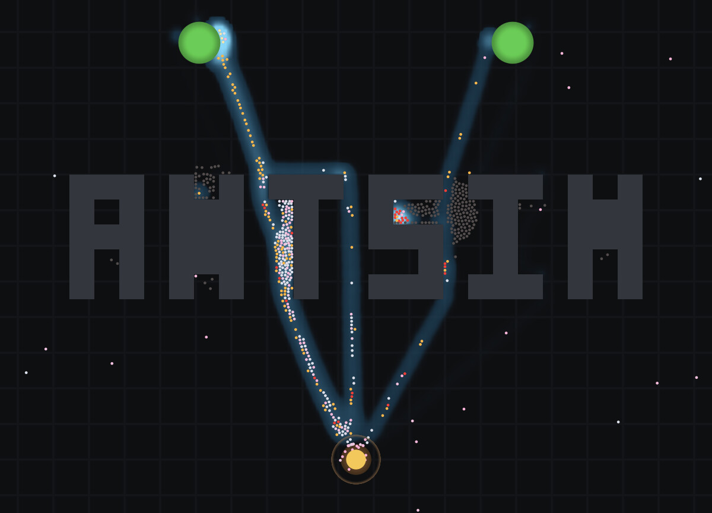
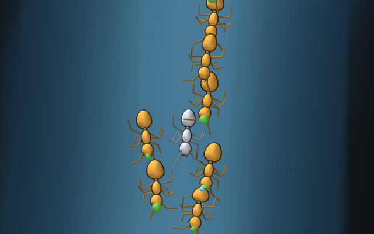
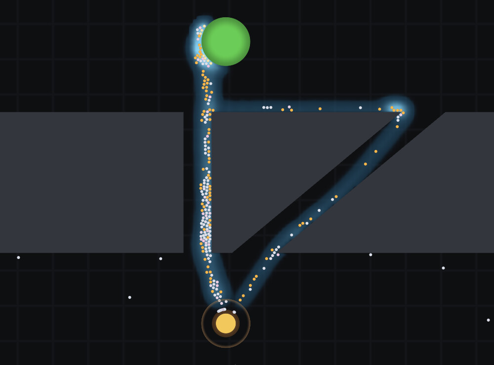
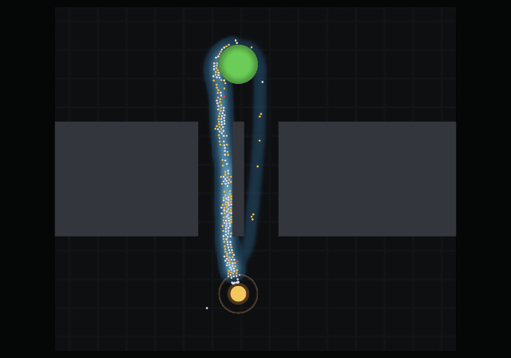

# antsim

**A 2D ant colony simulation built on real behavioural science, in Common Lisp,
rendered with OpenGL and ASCII-art.**



<sub>*The project's own name, spelled in obstacles, run as a scenario. The nest
is below the word and two food sources sit above it, so every trail has to find
its way through the lettering. Nothing in the simulation can see the word, plan a
route, or measure a distance — those two roads are a few thousand pheromone
packets, each one deposited by an ant that walked there.*</sub>

Ants leave the nest, walk a correlated random walk, find food, fill their crop,
navigate home by path integration, and lay pheromone on the return trip in
proportion to the quality of what they are carrying.
Other ants read that pheromone through a nonlinear choice function, which amplifies
a chance difference into a committed trail. Food depletes, trails evaporate, the colony
converts food into workers, and a colony that cannot reach food starves.

None of that is scripted. **There is no way to author a trail** — the scenario
format cannot express one, and no function exists to paint one.

And close enough, an ant becomes an ant.



<sub>*A trail at 4.5 cm. Six legs on an alternating tripod, sweeping antennae,
mandibles, a swollen gaster on the ants carrying a load — one mesh of ninety-odd
triangles, articulated in the vertex shader from eight floats per ant. The legs
do not slide, because the stride is driven by distance walked rather than by the
clock. [More in the diary](docs/DIARY.md#traffic--and-an-ant-close-enough).*</sub>

## Running it (sbcl, ultralisp)
```lisp
;; This Project is on ultralisp, so running is easy
;; (or just link the project folder to your quicklisp/local-projects folder)

;; ONLY If ultralisp is not already installed:
(ql-dist:install-dist "http://dist.ultralisp.org/" :prompt nil)


;; Run the OpenGL Version (libglfw and OpenGL 4.5 required)
(ql:quickload :antsim/live)
(ant:live-demo)

;; Run the ASCII Version (no dependencies, runs in every terminal)
(ql:quickload :antsim/tui)
(ant:tui)
```

See Makefile and below for more examples and how to load and write other scenarios

## Why Common Lisp

All 65 parameters of this model are specials, so an experiment is a `let` around
the run rather than a configuration mechanism. Every frame the body calls into
sees it, nothing global is mutated, the rebinding is per thread, and it is gone
when the form ends — **ad hoc and perfectly controlled at once**: side-effect
free, thread-safe, and incapable of leaking into the next run. You cannot do
this in Python.

It composes with the live image, which is the part that matters. At a SLIME REPL
you can take a colony that is *already running* and put it into different physics
for the next call, just by wrapping that call in a different `let` — same object,
same tick, and the conditions change back afterwards. A question you think of
twenty simulated minutes in does not cost you the twenty minutes.

SBCL compiles all of it straight to machine code — no VM, no JIT warm-up — and
with types declared the numeric core runs level with C and occasionally past it.
So the exploratory half and the tight loop are the same language in the same
file.

**[The full argument, with the code it rests on →](docs/WHYLISP.md)**

## It reproduces the published experiments

The point of building on real behavioural science is that the results are
*checkable*. Two of the founding experiments in the field are laboratory
apparatus with published outcomes, and both are in the test suite, with the
papers' own criteria. `make acceptance` runs them.



<sub>*Goss's double bridge. Two corridors lead from the nest to the food and one
is longer. Nothing in the model can measure a distance, compare two routes, or
tell that an alternative exists — yet the traffic collapses onto the short one,
because ants that take it get home sooner and lay pheromone sooner.*</sub>

Sixteen seeds each, the acceptance protocol — fixed colony, six minutes to
commit, six minutes measured:

| experiment | what it asks | mean busiest arm | result over 16 seeds |
|---|---|---|---|
| **Deneubourg's binary bridge** (1990) | two *equal* arms — does the colony break the symmetry? | 0.944 | commits every time, **9 / 7** between the arms |
| **Goss's double bridge** (1989) | one arm 1.73× longer — does it find the short one? | 0.814 | short arm wins **16 / 16** |



<sub>*Deneubourg's binary bridge. The two corridors are identical and one of them
is carrying all the traffic — that asymmetry is the entire result, and which side
it lands on changes with the seed.*</sub>

The binary bridge's second half is the harder one: a model that always picked
arm A would pass the first and be broken. The result is that the colony **makes
a choice**, not that it has a preference. The double bridge is the opposite — it
*should* look the same every run, so watching it pick the short arm over and
over is the result rather than a stuck seed.

In detail: [the sixteen-seed protocol and the table above](docs/experiments.md#individual-walking-speed-31--shipped)
· [symmetry breaking, off its own test rig](docs/experiments.md#symmetry-breaking-off-its-own-test-rig)
· [the density window](docs/experiments.md#the-double-bridge-has-a-working-density-window),
which is the one caveat to read before quoting either number — past about 900
ants congestion decides the route and the long arm wins outright, so a bridge
result quoted without its colony size is under-specified.

Both ship as scenarios too, so you can watch one instead of reading a number:

```sh
SCENARIO=scenarios/deneubourg-binary-bridge.json make live   # winner changes per run
SCENARIO=scenarios/goss-double-bridge.json make live         # short arm, every time
```

The apparatus is [`src/world/bridge.lisp`](src/world/bridge.lisp); the criteria
are recorded in
[§3.8](docs/concept.md#38-what-must-emerge--the-acceptance-list). Tests assert
that those scenario files and the Lisp constructors build the same apparatus
vertex for vertex, and that the binary bridge's arms are equal to the last
float — otherwise the published result and the thing you can look at would be
two different experiments with the same name.

## Getting it

Standalone builds are attached to each
[release](https://github.com/bonkzwonil/antsim/releases). Neither needs SBCL,
Quicklisp, or a checkout.

```sh
chmod +x antsim-*-x86_64.AppImage
./antsim-*-x86_64.AppImage                       # the demo
./antsim-*-x86_64.AppImage --list                # what else is in there
./antsim-*-x86_64.AppImage goss-double-bridge
./antsim-*-x86_64.AppImage --help                # options, and the window's keys
```

On Windows, unpack the zip and run `antsim.exe` — keeping the folder together,
because the program looks for its scenarios beside the executable and Windows
looks for `glfw3.dll` there too.

Both want a graphics driver providing OpenGL 4.5, which is any GPU driver of
the last decade. The Linux build is made on Ubuntu 22.04 and so runs on 22.04
and anything newer; GLFW is bundled, and OpenGL deliberately is not — it
belongs to your driver, and shipping a second one is the failure
[§5.4](docs/concept.md#54-headless-and-the-libgl-trap) is about.

There is no macOS build. macOS caps OpenGL at 4.1 — frozen in 2018, deprecated
since — which is well below what the renderer's shaders and buffers need, so
this is a [renderer port](docs/concept.md#7-milestones) waiting to happen
rather than a missing CI job.
[docs/shipping.md](docs/shipping.md#why-there-is-no-macos-build) has the count.

How the packages are built, and the things about a saved Lisp image that do not
survive being moved to another machine: [docs/shipping.md](docs/shipping.md).

## Running it

From source. Needs SBCL and Quicklisp. The Makefile points `CL_SOURCE_REGISTRY` at the
checkout, so a clone builds where it stands with no setup. GPU targets wrap the
command in a `guix shell`; see
[§4.6](docs/concept.md#46-building-and-running) for why, and for what to do when
a render comes back black.

```sh
make test              # core suite: RNG, pool, geometry, fields, ants
make acceptance        # the §3.8 experiments: both bridges, sixteen seeds
make live              # the interactive window
make tui               # the same, in this terminal — no GPU, no graphics
make gallery           # regenerate the documentation's images
make test-render       # renderer suite, on the GPU
make test-render-mesa  # the same suite in software — no GPU needed
make test-app          # the shipped binary's command line
make binary            # out/antsim, a standalone executable
make appimage          # dist/antsim-<version>-x86_64.AppImage

SCENARIO=scenarios/foraging.json make live
SEED=12345 make live   # repeat an exact run
SCENARIO=scenarios/foraging.json make tui
```

Seven scenarios ship:

| scenario | what it is for |
|---|---|
| `foraging` | a source that visibly empties, and a colony that starves when it does |
| `deneubourg-binary-bridge` | equal arms — the winner changes between runs |
| `goss-double-bridge` | unequal arms — the short one wins every time |
| `antsim` | the name in obstacles, on a desk-sized 1.00 × 0.72 m arena |
| `antsim-large` | the same word five times over, at 5.00 × 3.60 m |
| `antsim-overload` | the small arena with 1400 ants on 40 units of stock |
| `two-tribes` | two colonies, a private pile each that runs out, and one large source on the border between them |

Scenarios are JSON ([§6](docs/concept.md#6-the-scenario-file)) and validation is
strict: an unknown key is an error and the message names the path, because a
silently-defaulted typo produces a run that looks plausible and answers a
different question than the one you asked.

### The window

The window lists its own keys in the bottom-right corner, and opens at **4×**
rather than real time — the things worth watching take minutes to an hour.

| input | action |
|---|---|
| mouse wheel | zoom, anchored at the cursor |
| right-drag | pan |
| left-click | inspect an ant — state, energy, crop, age, distance home, and whether it has the reserve to set out |
| `a` | drop a food source at the cursor |
| `n` | resting ants: collide with each other, or pass through |
| `t` | step to the next colony — whose trail field is drawn, and whose counters the HUD shows |
| `space` | pause |
| `+` / `-` | time compression, halving and doubling |
| `home` | frame the whole world |
| `h` / `?` | hide or show the key legend |
| `q` / `escape` | quit |

Ants are coloured by what they are doing: pale outbound, warm orange carrying a
full crop, **red when they no longer have the energy to leave the nest**, grey
once dead.

The window draws a **fresh seed each session** and prints it, so no two runs are
alike and any worth keeping can be replayed with `SEED=`. That matters most on
the binary bridge, where the result is that the winning arm *varies*. The
headless paths — tests, acceptance, gallery — stay deterministic. A playground
and a result are different things.

### The terminal

`make tui`, or `antsim --tui`: the same colony drawn in characters, for a machine
that cannot open a window — a server over SSH, a container, a box with no graphics
stack at all. It needs **no GPU, no GL and no external library**: `sb-posix`
already carries everything a terminal needs, so this is the one view target with
no `guix shell` around it.

Seven simulated minutes of the built-in demo — `make tui` with no arguments —
copied out of a real run rather than drawn by hand:

```
t 420.0s · 150 ants · stock 689 · trail 68647 · 4x · 30 fps

                                 ↙

                               .,↙o←↘↖←
                               ,ooooo↖↖:
                               :,ooo↑↑↖:
                              .↓.  ;↓↓;
                              .:.  +↓*:
                              .,  ,+↓↑,
                              ,,  :↓↓+
                              ,,  ;↓↓;
                              ,, ,↓↓↓.
               ↑              ,, ;↓↑↙
                              ,,.+↑↑:
             ##################::*↗+
             ##################:+↑↑;                  ↑
                               ;*↓+.
                               +↗↓:
                               *↑+.
                              :↑↙;
                              .↙;,
                             @@@@
                      ↑       @@

     ↗
```

`@` is the nest, `o` a food source at its present size, `#` terrain, and
`.,:;+*` the trail, shaded on a log scale — a real trail sits two orders of
magnitude below the cap, so a linear ramp would show a blank arena with one
bright dot in it. Ants carry their bearing: `→↘↓↙←↖↑↗` by default, or `-\|/`
with `--ascii`, which shows the *axis* an ant is walking on but not which way
along it — a stroke has no arrowhead.

| input | action |
|---|---|
| arrows, or `hjkl` | pan by one cell |
| shift-arrows, or `HJKL` | pan by half a screen |
| `z` / `Z` | zoom in and out |
| `space` | pause |
| `.` | advance a single tick — the window has no such key |
| `+` / `-` | time compression, halving and doubling |
| `f` | frame the whole arena |
| `t` | step to the next colony |
| `a` | switch between ASCII and arrows |
| `c` | colour on or off |
| `?` | show or hide the key legend |
| `q` / `escape` | quit |

From a REPL it is `(ant:tui)` — no argument for the demo, a path for a file:

```lisp
(ql:quickload :antsim/tui)
(ant:tui)
(ant:tui "scenarios/two-tribes.json" :seed 42)
```

The terminal's size is **asked for, not assumed**, and asked again whenever it
changes — making the window bigger mid-run simply shows more world. Resizing it
smaller does not disturb the zoom. POSIX only: it is `termios`, which Windows
does not have, so the Windows build does not contain the terminal view at all
and `--tui` there says so and points you at the window.

## The documentation

- **[docs/concept.md](docs/concept.md) is the design document**, and the place
  to start for anything beyond running it: the science the model is built on
  and, more importantly, what was deliberately left out and why. There is an
  illustrated version at [docs/concept.html](docs/concept.html), published at
  [bonkzwonil.github.io/antsim](https://bonkzwonil.github.io/antsim/).
- **[docs/experiments.md](docs/experiments.md)** — the measurement log. What was
  changed, what it was measured against, and which of those measurements have
  since expired. A negative result has a shelf life.
- **[docs/DIARY.md](docs/DIARY.md)** — what a run actually looks like, frame by
  frame, and the eight failures that were caught by watching rather than by
  counting.
- **[docs/WHYLISP.md](docs/WHYLISP.md)** — why Common Lisp and SBCL are the
  right tools for this, argued against the code rather than in the abstract.
- **[docs/config.md](docs/config.md)** — every switch, its default, and where to
  set it.
- **[docs/shipping.md](docs/shipping.md)** — how a release is built, what is
  bundled and what is deliberately left to the user's machine, and the three
  opinions a saved SBCL image holds about its build machine that do not survive
  being moved to another one.

Three entry points into it:
[§3.3 the choice function](docs/concept.md#33-pheromones--the-field-and-the-nonlinearity-that-matters), which is the whole model
· [§3.8 the acceptance list](docs/concept.md#38-what-must-emerge--the-acceptance-list), which is the definition of "working"
· [§7 milestones](docs/concept.md#7-milestones).

## Where it is

**Version 1.1.1 — milestone M4 · 2026-08-22**, and the first line that ships
as a binary rather than as a checkout ([Getting it](#getting-it)). 1.1.1 is
1.1.0 with the terminal view kept out of the Windows build, where it could
never have worked and stopped the `.exe` being built at all. 1.1.0 adds
the [terminal view](#the-terminal) — `antsim --tui`, the same colony drawn in
characters, for a machine that cannot open a window. It is a minor rather
than a patch release because it is a new way in, and a leaf one: the terminal
view has no external dependency and nothing else in the tree depends on it, so
nothing that worked in 1.0.1 works differently in 1.1.0.

1.0.1 was 1.0.0 with route memory repaired: a full waypoint list now halves its
resolution instead of refusing new points, so it keeps the approach to the
food rather than the half of the walk a straight bearing could already do —
which, on a source behind a wall, was the difference between a mechanism that
helps and one that aims laden ants at the obstacle. M0 through
M4 are signed off, M2.1 and M2.2 landed their corrections along the way, and
**all ten of §3.8's in-scope rows now pass** — the last three, quality-driven
selection, the quality threshold and task reallocation, closed on the
two-source apparatus in [`src/world/trials.lisp`](src/world/trials.lisp).

**M3 finished with the encounter event**, and the prediction that justified
building it held: once the broad phase reports *this ant met that ant, at this
bearing*, recognition, giving way and trophallaxis are one function between them
and none is more than a handful of lines. A contact carries evidence about
*when* and never about *where* — this genus tests negative for tactile transfer
of direction, so a model that let a contact hand over a bearing would be
inventing a channel the animal has been shown not to have. **Lanes do not
form**, which §3.11 expected them to: on a 55 cm trail with 600 ants the mean
lateral offset between the outbound and returning streams is 1.7 mm with the
give-way rule and 2.1 mm without. What giving way buys is throughput, which is
the smaller claim and the one there is evidence for.

**M4 is the society.** Multiple colonies, which needed no change to the tick at
all — §3.12's per-colony indirection held, and the work was apparatus.
Necrophoresis on Deneubourg's sorting model, which takes the corpses within 6 cm
of a nest from 24 to 0. And **route memory**, which closes the oldest open flaw
in the model: the home vector is a vector and not a path, so a laden ant used to
drive at whatever stood between it and the nest and slide along it. An ant now
keeps its own outward track and falls back to it when the bearing home is
blocked — harvest 888 → 1264 on the word scenario, whose entire geometry is
concavities, and no change at all on an arena with one small wall, which is the
right shape of result for a fix aimed at concavities.

Response thresholds, the no-entry field and search spirals also ship, and are
**inert at shipped parameters** for three different measured reasons. They are
failure-recovery mechanisms, and the finding is that this model's ants do not
currently fail in the ways they recover from.

**M5 — interaction — is next**: what you can *do* to a running world.

The full record, including what shipped switched **off** and why, is
[§7](docs/concept.md#7-milestones).

## Copyright and licence

Copyright © 2026 Mathias Menzel-Nielsen. All rights reserved.

<p align="right"><em>Lisp is geil</em></p>
