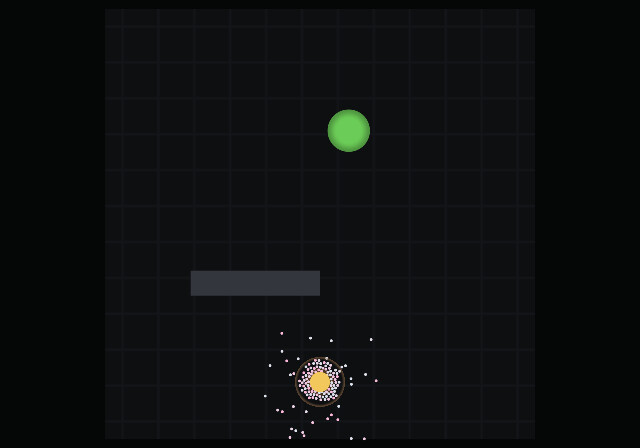
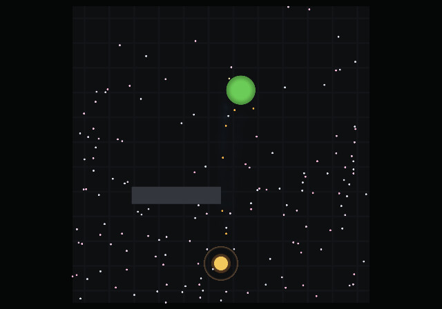
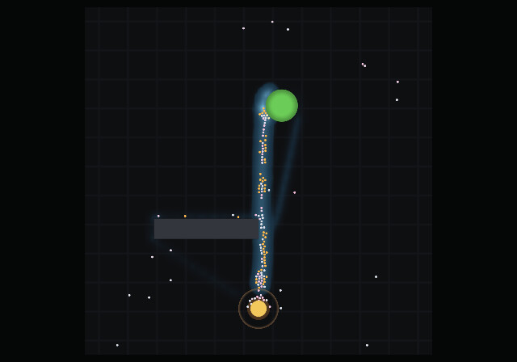
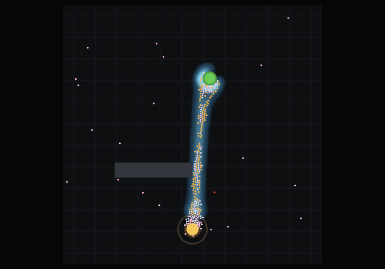
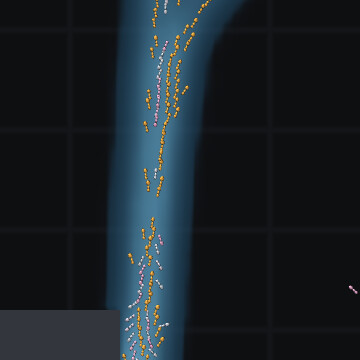
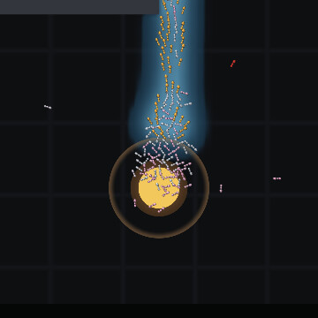
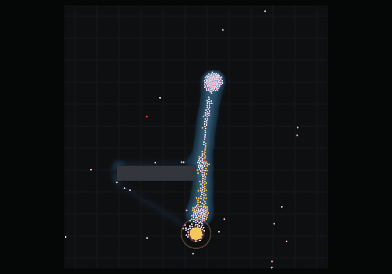
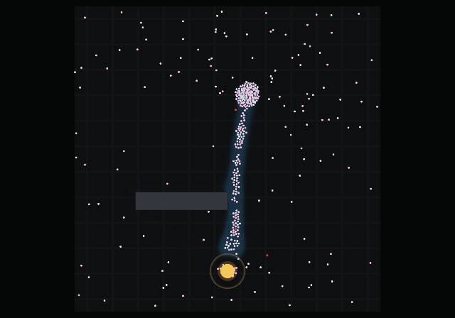
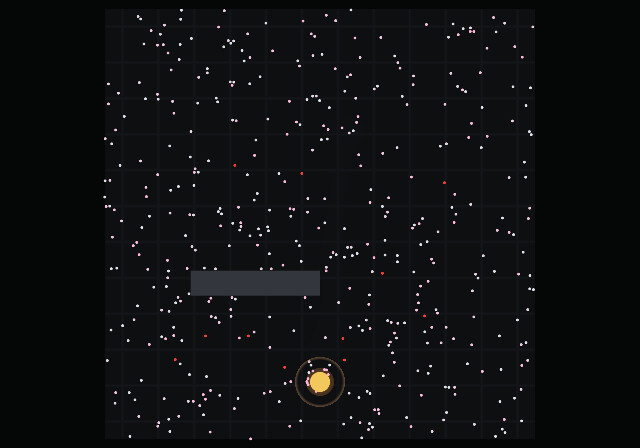
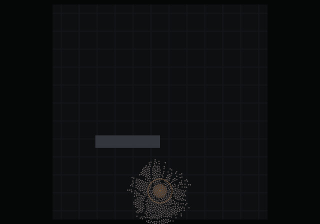

# Diary

What a run looks like, and what watching it found.

This is the narrative file. [concept.md](concept.md) is the design document —
the science the model is built on and what was deliberately left out.
[experiments.md](experiments.md) is the measurement log — what was changed, what
it was measured against, and which of those measurements have since expired.
This one is neither: it is the record of a colony doing its thing, in the order
it does it, and of the things that were caught by looking rather than by
counting.

Every image is generated by `make gallery` from a fixed seed, so the pictures
cannot drift away from what the simulation does. Every population and pheromone
total quoted below is printed by that same run, and both were regenerated
together — so the numbers describe the pictures beside them rather than an
earlier version of them.

---

## A run, start to finish

The scenario is `foraging`: one nest, one finite source, one obstacle between
them. The same colony and the same seed throughout.

### Nothing — 5 seconds

At 5 seconds the pheromone total is *exactly* zero. No ant has reached the food,
so nothing has been laid, and the choice function is running with nothing to
read — which makes it, exactly, the correlated random walk. There is no
trail-following mode to switch on: following and exploring are the same rule in
two different environments.

### The first thread — 40 seconds

At 40 seconds the total is 839 and one faint line runs from the food to the
nest. That is the first ants home, laying the first pheromone.

### Two routes — 5 minutes

By 5 minutes the thread has become a road, and it is not the only one: a second,
fainter route cuts diagonally from the nest to the source, and a third stub runs
off to the left. Traffic is on all of them.

The total is 53 840, and the population is still exactly the 150 it started
with: the colony is feeding itself but has not yet banked enough surplus for the
queen to lay against, and the brood she does lay takes time to emerge
([§3.10](concept.md#310-colony-growth--a-population-not-a-headcount)). Growth
comes later, and lags the food that pays for it.

### One road — 20 minutes

By 20 minutes it is running one route, and there is no trace of the others. The
total is 126 333 and the population has reached 294 — the queen's first brood
has emerged, paid for by the trail in the picture.

*The nest is the disc at the bottom, the food source the green disc at the top,
and the blue field is pheromone the ants laid themselves. The colour turns where
the concentration crosses `k`, the point at which ants stop exploring and start
committing — so the bright core is the part they are actually reading as a road,
and the halo around it is the same deposits fading off by radius.*

Nothing chose between them. The choice function is nonlinear —
`P(i) ∝ (k + C_i)ⁿ` with `n = 2`
([§3.3](concept.md#33-pheromones--the-field-and-the-nonlinearity-that-matters))
— so whichever route happens to be marginally better used gets marginally more
traffic, which makes it marginally stronger, and the difference runs away with
itself. That amplification is the entire model, and here it is doing its job in
the gap between two pictures. Set `n = 1` and this never happens: the colony
splits evenly between routes forever, which is a control the test suite keeps.

Ants do not paint a stripe. A laden ant puts its gaster down every couple of
centimetres, and each touch is a **packet** — a point whose intensity falls away
exponentially with radius. The road in the picture is a few thousand of those
overlapping, which is why it has a soft edge instead of a hard one.

The colour scale is identical across every image in this file, so a trail that
looks stronger is stronger.

### Traffic — and an ant, close enough

On the surviving road, traffic runs both ways at once.

*Outbound ants are pale, laden returners warm orange, and both streams share one
road. Zoomed to 18 cm — close enough that the level of detail has already handed
over to the articulated body.*

*The same stretch of trail at 4.5 cm. Six legs on an alternating tripod, two
antennae, mandibles, a swollen crop on the ants carrying one, and the pale blue
dot at a gaster tip is the exact moment a pheromone packet went into the ground.
Nothing here is a sprite: it is one mesh of ninety-odd triangles, articulated in
the vertex shader from eight floats per ant.*

The thing worth watching is the **legs**, and specifically that they do not
slide. The stride phase advances with the **distance an ant has walked**, not
with the clock, so over the half-cycle a leg spends on the ground its foot
slides backward through the body exactly as fast as the body slides forward —
which means the foot is standing still in the world, which is what a foot does.
Drive the same animation from a timer and every ant moonwalks. It is one
divisor, and it is the whole difference between an ant that walks and an ant
that is dragged.

The rest of what is drawn is mechanism rather than decoration:

- **Antennae sweep, and lean toward what they smell.** Each one samples the
  pheromone field either side of its own tip and bends toward the stronger, by
  the same comparison the ant's own choice function makes
  ([§3.4](concept.md#34-navigation--three-systems-not-one)). You can watch an
  antenna find a trail several ticks before the body turns onto it.
- **The gaster tips down** at the instant a packet is deposited — a visible
  event marking an otherwise invisible mechanism — and the mark it leaves is
  drawn in the trail's own colour.
- **A full crop is a fat gaster**, because *Lasius* carries liquid and the crop
  is internal. The bead at the mandibles is the conventional cue; the swelling
  is the honest one.
- **Dead ants curl their legs under** and stay where they fell
  ([§3.11](concept.md#311-bodies--a-disc-for-every-ant-and-one-non-overlap-rule)),
  so the approaches to a starving nest fill up with recognisable corpses rather
  than with grey dots.
- **No two ants walk at quite the same speed**, so they overtake and bunch
  instead of moving in convoy. That one is not drawing at all — it is a ±10%
  lifelong difference between individuals in the model, and the gait follows it
  for free, because the stride is driven by distance covered.

Zoom out and it all goes away. At about four pixels an ant loses its legs, and
below that it is the plain disc it always was — the pheromone shader antialiases
a circle better than ninety triangles ever will, and at three pixels the legs
are noise. Every whole-arena picture in this repository is drawn by exactly the
shader that drew it before the ant had legs.

### The nest

*The nest disc with its arrival radius as the surrounding ring, and the trail
coming in from the source. The gold disc inside is the food stored in the nest,
drawn so its **area** is the quantity — it visibly empties rather than staying
full until the instant it is gone. Food sources do the same thing, except that
theirs is the real collision circle: a pile half eaten is half the area, offers
a shorter edge, and so feeds fewer ants at once.*

Whether resting ants collide with each other is a live toggle (**N**) rather
than a default. Passing delivers about 4.5% more food and keeps a departing ant
setting off from the spot it arrived at, so the exit bearing it remembers still
matches the direction it leaves in; colliding reads better on screen. The model
has no basis for ranking those against each other, so the switch stays visible
rather than buried in a default
([experiments.md](experiments.md#the-nest-crowd-explained--and-an-ab-that-expired)).

### The source runs out — 28 minutes

The source in this scenario is finite, and it runs out after 28 minutes. What
happens over the next six is the part worth watching.

At the moment the source empties, the trail is at full strength — 93 890 units —
and the colony is still pouring ants onto it.

Following a trail and depositing on one are **separate rules**. An ant follows
whatever pheromone is in front of it; an ant deposits only when it is carrying
food. So the traffic continues and the renewal stops, and evaporation starts
taking the road out from under the ants still walking it.

**Two minutes later** the trail is down to 13 759 — 85% gone — and the ants are
still packed along the line where it was, including a knot where the food used
to be. Not one of them is orange, because there is nothing left to carry.

**Six minutes** and it is 252, from 93 890. The structure is simply gone, and
with it every trace of where the food had been. The colony disperses back into
the random walk it started with — and the red ants are the ones that no longer
have the reserve to try again.

The population is *rising* through all three frames — 390, 414, 462 — because
the colony is still converting its stored food into workers while its road
dissolves. It is at its largest a few minutes after it has already lost.

That is evaporation doing the job it exists for. It is the only mechanism by
which a colony can forget, and without it these ants would walk to an empty
patch of ground for ever.

### And then the colony

As the larder runs down, the ants' **urge to forage rises**: departures get more
frequent and foragers push deeper into their own reserve before turning back.
The nest empties itself out of doors — on a larger colony watched in the window,
589 of 667 ants were outside at once — they search, they find nothing, and they
come home spent. By 60 minutes the population is 0, the stock is 0, and the
field has evaporated to nothing at all: there is no pheromone left anywhere to
say a road was ever there.

*The corpses are the pale discs, packed into a rosette around the nest entrance
— they came home to die. Nothing removes them, because nothing in the colony
knows how yet: necrophoresis is a later milestone, and until it exists the dead
stay where they fell.*

---

## What the window found

The renderer was built early, on the argument that **the model's failures are
shaped like pictures** — that some of them would be obvious on screen and
invisible in any statistic worth printing. That has now happened eight times.
Ants pinned along all four arena walls. Ants stranded with a full crop and a
home vector reading zero. A shell of resting ants at a radius nothing explained.
Newborns filing out to the left in a line. A food source that stayed fat and
green while the colony starved next to it. Ants dying inside the concave letters
of the word scenario
([experiments.md](experiments.md#pockets-kill-ants-and-the-word-scenario-is-the-reproducer)).

Two of those are worth telling at length, and neither left a mark on any number
the program was printing at the time.

### The colony could starve with the door shut

Setting out required energy. Energy came from the nest's stock. The stock came
from ants setting out. When a source ran dry, those three closed into a ring:
every forager came home, dropped below the departure threshold, could not be
fed, and lay in the nest until it died of old age — without one of them ever
going out to look. Measured at the time: **499 ants in the nest, 0 outbound, for
the rest of the run.**

Every aggregate being printed looked plausible. Population declining, stock
zero, trail decaying. It reads as a colony starving. It was a colony
*deadlocked*, and the tell was on screen, not in the numbers — a nest quietly
filling up with ants that were not leaving.

The fix is the same shape as the biology: a hungry colony forages *harder*.
Foraging urgency rises as stock-per-worker falls, which raises the departure
rate and lowers **both** energy thresholds — the one an ant needs to set out,
and the one at which an ant already out gives up. Both, because moving only the
first would push a starving ant out of the door and turn it round on the very
next tick, which is the same deadlock standing somewhere else.

No ant gained any knowledge it could not have. An ant is fed from the stock
while it rests, and **being given nothing is a local fact about its own body**.
Nothing here tells an ant about food it has not visited.

Exhausted ants are now drawn **red**, which is the other half of the fix: a nest
filling with spent ants had been indistinguishable on screen from a nest full of
ants declining to leave — and was read as exactly that, by a human watching.
That is the whole argument for the window in one sentence.

The rule is recorded in [§7](concept.md#7-milestones); the trough it came out of
is measured in
[experiments.md](experiments.md#the-trough-why-colonies-starved-with-food-coming-in).

### Ants that left the nest backwards

Ants returning from the food would set off again and wander off with no apparent
plan.

They were not wandering. Departure never set a heading, so an ant left with the
heading it arrived on — and a returning ant steers *at* the nest, so that
heading pointed **inward**. Every departing ant walked out through the entrance
and straight on, away from everything it knew. Measured over 613 departures on
an established trail:

| | before | after |
|---|---|---|
| left within 15° of the source | **0.0%** | **34.3%** |
| left more than 150° away | 36.9% | 2.4% |

Not one ant in 613 left towards the food it had just come back from. "No plan"
was generous; it was the worst available direction, chosen systematically.

Each ant now remembers one bearing and sets off along it, scattered by about
29°. The bearing is read off the ant's **own path integrator** at the moment it
leaves a source — the home vector points from ant to nest, so its reverse is the
nest→food bearing as that ant believes it. Nothing global is consulted. Only a
trip that actually brought food back overwrites it, and a newborn's is random,
which is what keeps the naive ants exploring.

Fixing it exposed a bug of a rarer kind. The scatter was drawn from the same RNG
stream as the *decision* to leave — and an ant only leaves when that draw comes
out below 0.005. The normal draw is Box-Muller,
`z = √(−2 ln u₁)·cos(2πu₂)`, and it reuses that same `u₁`: conditioning on
`u₁ < 0.005` forces `√(−2 ln u₁)` above 3.2 every single time. Every ant left on
a wild angle, deterministically. The draws look independent and are not — which
is the one way a counter-based RNG can still catch you out.

