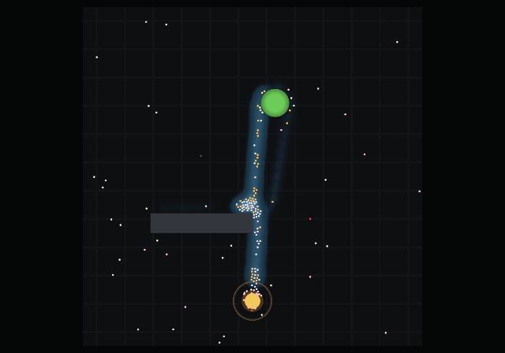
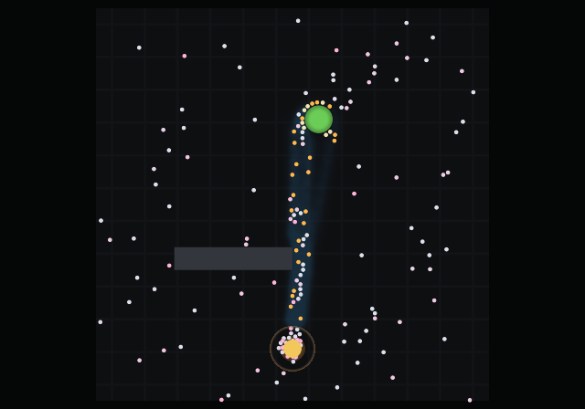

# Half an hour, and two animals

The M6 gallery. Two questions the earlier pictures could not answer:
*when* does a colony do what it does, and *what would a different animal
do instead*.

Every image here is generated — `make gallery` and `make timelapse` —
from a fixed seed, so the pictures cannot drift away from what the
simulation does. Every number quoted is printed by those same runs, and
the pictures and the numbers were regenerated together, so each describes
the other rather than an earlier version of it.

---

## Half an hour on one page

[`docs/DIARY.md`](DIARY.md) shows a colony at five seconds, forty
seconds, five minutes and twenty minutes. Those are the right moments,
and choosing them is the problem: a still is an argument about which
instant mattered, and the reader has to take it on trust.

So here is the whole run instead. Ninety-one frames, twenty simulated
seconds apart, every one captioned with its own clock.

*Time runs left to right, then down. The green disc is the food
source and it visibly shrinks; the orange disc at the bottom is the nest.
Blue is trail pheromone, and it is drawn on a diverging map that turns at
the detection threshold — dim below `k`, bright above it — so the colour
says* is this enough to commit to *without a legend
([§5.3](concept.md#53-colour)).*

The shape of a foraging run, read off the sheet and confirmed by the
totals the run printed:

| | | |
|---|---|---|
| **0–20 s** | trail exactly **0** | not one ant has reached the food and come back. Everything moving on those two tiles is the correlated random walk of [§3.2](concept.md#32-individual-movement) running with nothing to read |
| **40 s** | trail **959** | one thread |
| **2 min** | trail **17 954** | a road |
| **5 min** | trail **50 129** | established, and it stays in that band for twenty minutes |
| **20 min** | **293** ants, trail **82 692** | the colony has doubled on the food it is bringing in ([§3.10](concept.md#310-colony-growth--a-population-not-a-headcount)) |
| **26 min** | trail **116 994** | the peak |
| **30 min** | **411** ants, trail **2 594** | the source is gone |

The last row is the one worth staring at. **The trail falls from 116 994
to 2 594 in four minutes** — a factor of forty-five — and nothing decided
that. No ant knows the pile is empty; there is no signal for it and no
rule anywhere that says *stop*. Ants simply stop finding food, so they
stop reinforcing, and evaporation does the rest. The collapse is the
decay constant made visible, and it is at the *end* of the sheet rather
than in the middle of it because the source lasted twenty-six minutes.

That is also the honest answer to why the sheet is worth committing when
a still is cheaper. Twenty-five of these tiles are nearly identical, and
that is information: the trail is *stable*, not merely present. Four of
them are not, and if the gallery had sampled at twenty and thirty minutes
the entire collapse would have happened between two pictures.

The population, meanwhile, goes 150 → 411 without a single tile making it
obvious. Growth is the slow variable here and traffic is the fast one, so
the sheet shows the road and the counters show the colony — which is the
argument for the run printing its numbers alongside the frames rather
than instead of them.

---

## Two animals, one arena

*Lasius niger* is the animal this model was built for and every default
in `src/params.lisp` describes it. M6 added a second parameter set, so
the same arena can be run with a different animal in it
([§3.1](concept.md#31-species-and-the-scale-it-sets)).

Both frames below are the same world, the same seed, the same obstacle,
the same source, at the same moment — **ten minutes**. The only
difference between the two runs is the value of one key in the scenario
file.

***Lasius niger.*** *A committed road. Trail total **49 181**. The
road is wide because hundreds of ants are laying on top of one another's
marks, and it loops around the obstacle because that is where the first
successful ants happened to go — the colony is following its own history,
not the geometry.*

***Formica polyctena.*** *The same ten minutes. Trail total
**3 397** — fourteen times less. There is a line, and it is nearly
straight, and it is one ant wide.*

The contrast is the point, and it is not a matter of one animal being
worse at this. *Lasius* is a mass recruiter: it converts a small
difference between two routes into a committed trail, collectively,
through the chemistry, with no individual knowing anything
([§3.3](concept.md#33-pheromones--the-field-and-the-nonlinearity-that-matters)).
*Formica polyctena* is the same problem solved from the other end — a
poor trail follower that navigates by remembered route, so what you see
is not a gradient being followed but a path being walked. The scattered
ants everywhere are not lost; they are the individual exploration that a
weak trail does not suppress.

The model produces that difference from eighteen numbers and no new code
at all. The trail is weakened three ways at once — deposition, following
fidelity, and the time constant — and the route memory is turned up,
because those are the two halves of the same animal
([config.md](config.md#species-31) has the full table).

### One number in these pictures is not what it looks like

Formica harvests **1145** units by ten minutes against Lasius's **640**,
and it would be easy to write that up as *the route beats the trail*.

It is not that. Formica also walks at 4 cm/s against 2, and 1145/640 is
1.79 against a speed ratio of 2.0. **Nearly all of the harvest difference
is pace**, and a comparison of two animals that differ in eighteen
parameters cannot attribute an outcome to any one of them.

What these two frames *do* support is the claim about the trail, because
that one is a fourteen-fold difference in a quantity neither animal's
walking speed appears in. The measurements that separate the rest are in
[experiments.md](experiments.md).

There is a second trap in this pair, and it decided which moment they
were taken at. At twenty minutes — where `03-trail.png` is taken — Formica
has already stripped the whole 2500-unit pile, and its trail, on a 600 s
time constant against Lasius's 1800, has decayed to nothing. That frame
shows an *aftermath*. Put beside a Lasius colony still working, it would
read as a devastating result about trail-following and would be an
artefact of photographing two different situations.

---

## What is not here

No video. A frame sequence piped to `ffmpeg` was considered at M2 and
[§5.5](concept.md#55-the-live-window-and-why-the-camera-comes-early)
records the judgement: no new dependency, fine for sharing results,
useless for interaction. `render-timelapse` will write the frames if
asked — `(render-timelapse-demo :frames t)` — and they are deliberately
not the committed artefact. `png.lisp` writes stored deflate blocks so
that the renderer needs no compression dependency
([§4.1](concept.md#41-systems-and-files)), which means a frame costs
860 kB whatever is in it and half an hour of them is some 300 MB. The
contact sheet is one file and reads as a sequence, which a directory does
not.

No macOS. [§7](concept.md#7-milestones) explains why at length, and the
short version is that Apple froze OpenGL at 4.1 in 2018 and this renderer
needs 4.4.
